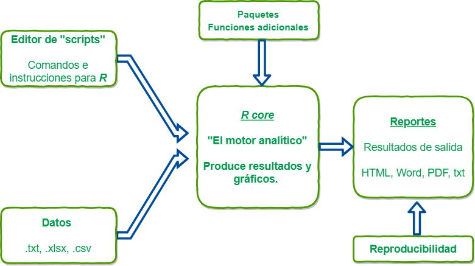
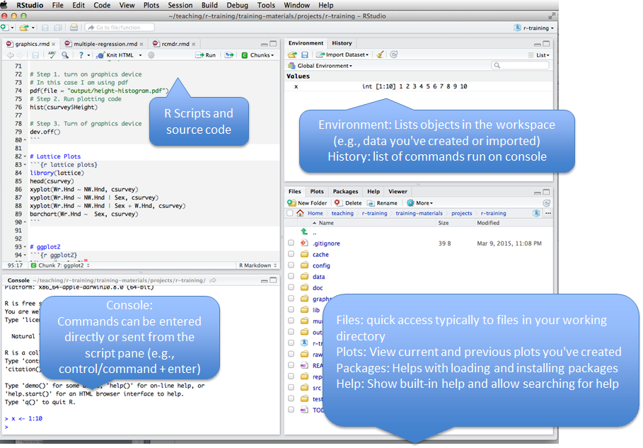
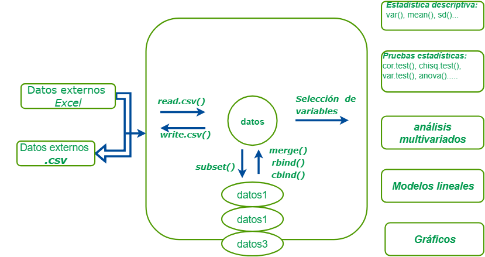
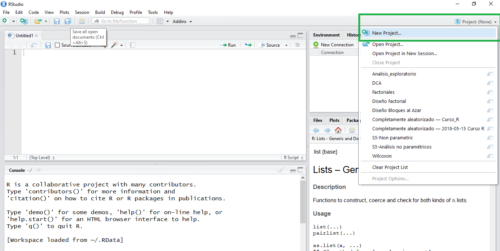
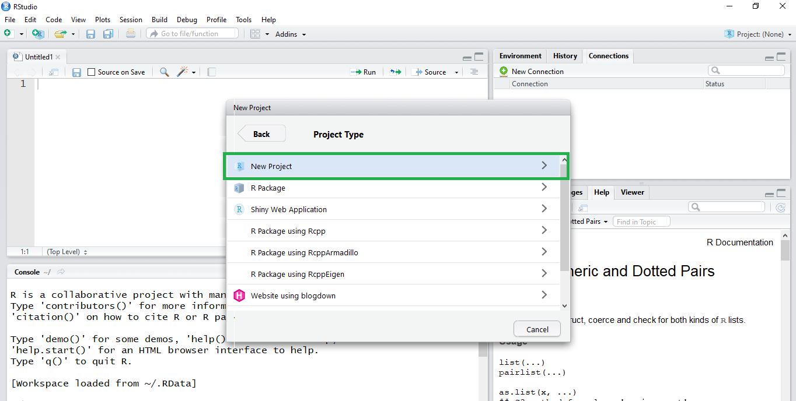
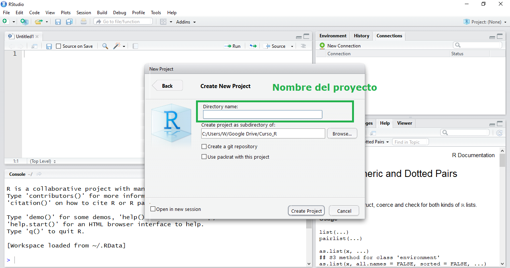
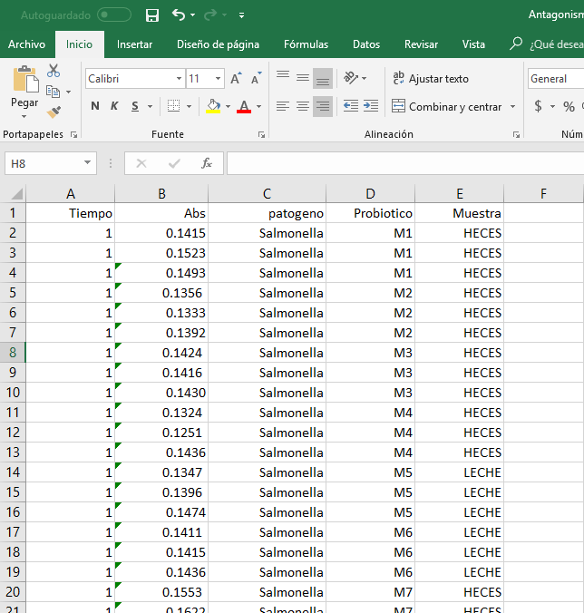

## Hablemos de **R**

```{r, echo=FALSE,fig.align='center'}
      
```

---

## Hablemos de **R**

```{r, echo=FALSE,fig.align='center'}
      
```

---

## Hablemos de **R**

```{r, echo=FALSE,fig.align='center'}
      knitr::include_graphics('./assets/img/Ruso.gif')
```

---

## Hablemos de **R**

```{r, echo=FALSE,fig.align='center'}
      knitr::include_graphics('./assets/img/Rscholar.png')
```

---

## Instalación de **R**

Empezaremos por lo más básico, Podemos instalar **R** desde el siguiente link: https://www.r-project.org/

Pero como muchos somos algo despistados, estas son las maneras más sencillas para instalar **R** en distintos Sistemas Operativos:

|Sistema Operativo | Método   |
|------------------|----------|
|   Windows        | https://cran.r-project.org/bin/windows/base/old/3.4.2/R-3.4.2-win.exe |
|Debian y derivados|`sudo apt-get install r-base`                           |
|Redhat y derivados| `sudo yum install R-core R-devel`                      |
|     Mac          | https://www.youtube.com/watch?v=ICGkG7Gg6j0            |

---

## Entornos de desarrollo para R

Una vez instalado, un entorno de desarrollo integrado será necesario para facilitar el desarrollo de códigos en **R**, por lo que se presentan tres de varias opciones para trabajar con **R**. 

|       IDE             |  Link     |
|:---------------------:|-----------|
|   Tinn-R              |https://sourceforge.net/projects/tinn-r/ |
|R-Studio [Recomendado] |https://www.rstudio.com/ |
| R commander (Rcmdr)   |http://www.rcommander.com/ |


---

## Rstudio


```{r, echo=FALSE,fig.align='center',out.width = "900px"}
      
```

---

## Flujo de trabajo  sugerido en Rstudio

```{r, echo=FALSE,fig.align='center'}
      
```

--- 


## Flujo de trabajo  sugerido en Rstudio

```{r, echo=FALSE,fig.align='center',out.width = "900px"}
      
```

--- 

## Flujo de trabajo  sugerido en Rstudio

```{r, echo=FALSE,fig.align='center',out.width = "900px"}
      
```

--- 

## Flujo de trabajo  sugerido en Rstudio

```{r, echo=FALSE,fig.align='center',out.width = "900px"}
      
```

--- 

## Flujo de trabajo  sugerido en Rstudio

```{r, echo=FALSE,fig.align='center',out.width = "400px"}
      
```

--- 

## Empezemos....... 

```{r, echo=FALSE,fig.align='center',out.width = "600px"}
      knitr::include_graphics('https://media.giphy.com/media/3oz8xOJiQ9VtnOKAIU/giphy.gif')
```

--- 

## 0. Estructura de datos 

```{r, echo=FALSE,fig.align='center',out.width = "600px"}
      
```


--- 

## 1. Importando datos a R 


> _Tips_: cosas que podrían producir problemas.


+ El _separador decimal_ SIEMPRE SIEMPRE será un punto. 

+ Nombres de columnas: no debe comenzar con números, tienen que ser sencillos y sin espacios ni caracteres especiales.
Como sugerencia, los nombres de columnas deben ser cortos, ya que tendrás que escribirlos muchas veces.

+ _R_ diferencia entre mayúscula y minúscula. `Rosa no es lo mismo que rosa`. 

+ Si en una columna hay _datos faltantes_ se debe dejar `espacio en blanco` o remplazar con `NA` (con mayúsculas).

--- 

## 1. Importando datos a R 

La forma más sencilla de importar un `.csv` es a través del comando `read.csv(...)`, cuya implementación es la siguiente:

```{r ImportarCSV, eval=F}
read.csv(file, header = TRUE, sep = ",", dec = ".", ...)
```

Dónde:

| Argumentos  | Significado o uso  |
|-------------|-------------------|
| `file`      | Ruta al archivo  |
| `header`    | Valor lógico para determinar si el archivo incluye encabezados en la primera linea.   |
| `sep`       | Este campo sirve para especificar el carácter de separación. |
| `dec`       | El carácter usado para los puntos decimales  |
| `...`       | Ver la documentación para argumentos extras   |


--- 
## 1. Importando datos a R 


Un ejemplo sería el siguiente:

```{r readcsv2,eval=F}
datos <- read.csv("dataframe1.csv",, header=T, sep=';', dec=',')
```

--- 