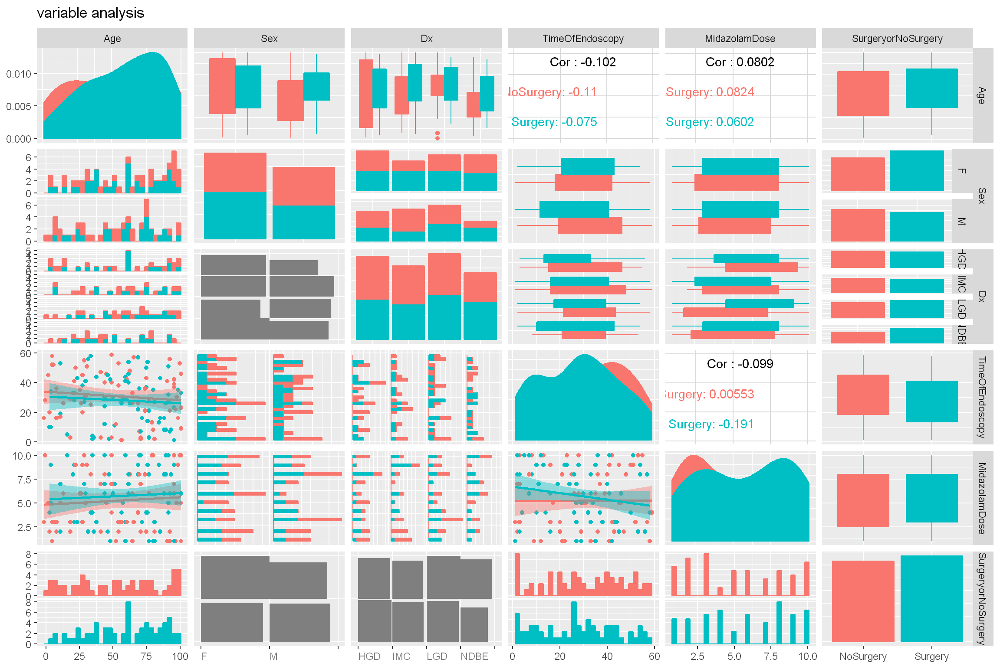
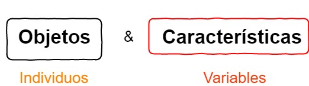
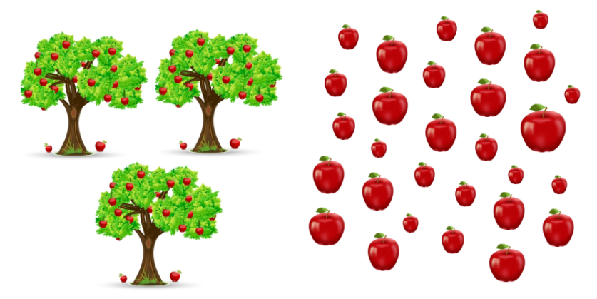
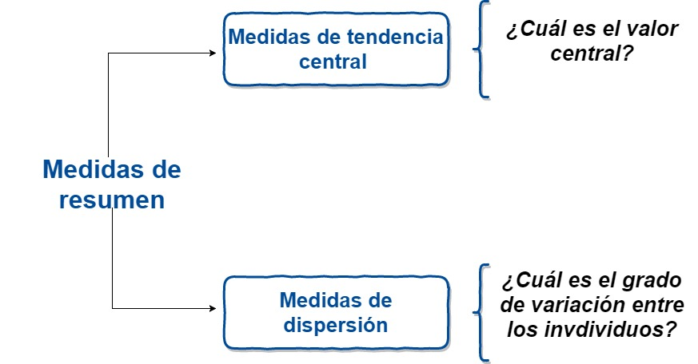
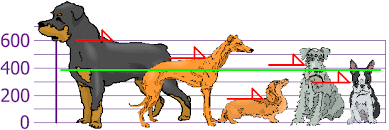

## Hablemos de **R**

```{r include=FALSE}
library(utils)
```


```{r, echo=FALSE,fig.align='center'}
      knitr::include_graphics('./assets/img/R.png')
```

---

## Hablemos de **R**

```{r, echo=FALSE,fig.align='center'}
      knitr::include_graphics('./assets/img/Rcurve.png')
```

---

## Hablemos de **R**

```{r, echo=FALSE,fig.align='center'}
      knitr::include_graphics('./assets/img/Ruso.gif')
```

---

## Hablemos de **R**

```{r, echo=FALSE,fig.align='center'}
      knitr::include_graphics('./assets/img/Rscholar.png')
```

---

## Instalación de **R**

Empezaremos por lo más básico, Podemos instalar **R** desde el siguiente link: https://www.r-project.org/


|Sistema Operativo | Método   |
|------------------|----------|
|   Windows        | https://cran.r-project.org/bin/windows/base/old/3.4.2/R-3.4.2-win.exe |
|Debian y derivados|`sudo apt-get install r-base`                           |
|Redhat y derivados| `sudo yum install R-core R-devel`                      |
|     Mac          | https://www.youtube.com/watch?v=ICGkG7Gg6j0            |

---

## Entornos de desarrollo para R

Una vez instalado, un entorno de desarrollo integrado será necesario para facilitar el desarrollo de códigos en **R**, por lo que se presentan tres de varias opciones para trabajar con **R**. 

|       IDE             |  Link     |
|:---------------------:|-----------|
|   Tinn-R              |https://sourceforge.net/projects/tinn-r/ |
|R-Studio [Recomendado] |https://www.rstudio.com/ |
| R commander (Rcmdr)   |http://www.rcommander.com/ |


---

## Rstudio


```{r, echo=FALSE,fig.align='center',out.width = "900px"}
      knitr::include_graphics('./assets/img/Rstudio.png')
```

---

## Flujo de trabajo  sugerido en Rstudio

```{r, echo=FALSE,fig.align='center'}
      
```

--- 


## Flujo de trabajo  sugerido en Rstudio

```{r, echo=FALSE,fig.align='center',out.width = "900px"}
      
```

--- 

## Flujo de trabajo  sugerido en Rstudio

```{r, echo=FALSE,fig.align='center',out.width = "900px"}
      
```

--- 

## Flujo de trabajo  sugerido en Rstudio

```{r, echo=FALSE,fig.align='center',out.width = "900px"}
      knitr::include_graphics('./assets/img/rf3.png')
```

--- 

## Flujo de trabajo  sugerido en Rstudio

```{r, echo=FALSE,fig.align='center',out.width = "400px"}
      knitr::include_graphics('./assets/img/ef4.png')
```

--- 

## Empecemos....... 

```{r, echo=FALSE,fig.align='center',out.width = "550px"}
      knitr::include_graphics('https://media.giphy.com/media/3oz8xOJiQ9VtnOKAIU/giphy.gif')
```

--- 

## 0. Estructura de datos 

```{r, echo=FALSE,fig.align='center',out.width = "600px"}
      knitr::include_graphics('./assets/img/dest.png')
```


--- 

## 1. Importando datos a R 


> _Tips_: cosas que podrían producir problemas.


+ El _separador decimal_ SIEMPRE SIEMPRE será un punto. 

+ Nombres de columnas: no debe comenzar con números, tienen que ser sencillos y sin espacios ni caracteres especiales.
Como sugerencia, los nombres de columnas deben ser cortos, ya que tendrás que escribirlos muchas veces.

+ _R_ diferencia entre mayúscula y minúscula. `Rosa no es lo mismo que rosa`. 

+ Si en una columna hay _datos faltantes_ se debe dejar `espacio en blanco` o remplazar con `NA` (con mayúsculas).

--- 

## 1. Importando datos a R 

La forma más sencilla de importar un `.csv` es a través del comando `read.csv(...)`, cuya implementación es la siguiente:

```{r ImportarCSV, eval=F}
read.csv(file, header = TRUE, sep = ",", dec = ".", ...)
```

Dónde:

| Argumentos  | Significado o uso  |
|-------------|-------------------|
| `file`      | Ruta al archivo  |
| `header`    | Valor lógico para determinar si el archivo incluye encabezados en la primera linea.   |
| `sep`       | Este campo sirve para especificar el carácter de separación. |
| `dec`       | El carácter usado para los puntos decimales  |
| `...`       | Ver la documentación para argumentos extras   |


--- 

## 1. Importando datos a R 


Un ejemplo sería el siguiente:

```{r readcsv2,eval=F}
datos <- read.csv("dataframe1.csv",, header=T, sep=';', dec=',')
```

--- 

## 2. Manejando datos
### ¿Que son los __dataframes o conjunto de datos__? 

```{r, echo=FALSE,fig.align='center',out.width = "400px"}
      knitr::include_graphics('./assets/img/df.png')
```

---


## 2. Manejando datos
### Inspeccionado el contenido de un `dataframe`

Las funciones `str()`, `head()`, `summary()` pueden ser útiles para verificar el contenido y estructura de un `dataframe`.

```{r}
head(mtcars)
```

---

## 2. Manejando datos
### Inspeccionado el contenido de un `dataframe`


```{r}
str(mtcars)
```

---


## 2. Manejando datos
### Inspeccionado el contenido de un `dataframe`


```{r}
summary(mtcars)
```

---


## 3. Funciones más comunes 

|   Función   |           Matemáticas                 | Función       |           Estadísticas        |
|:-----------:|---------------------------------------|:-------------:|-------------------------------|
|   sqrt(x)   | Raíz de $x$                           |    mean(x)    | Media                         |
|    exp(x)   | Exponencial de $x$                    |     sd(x)     | Desviación estándar           |
|    log(x)   | Logaritmo natural de $x$              |     var(x)    | Varianza                      |
|   log10(x)  | Logaritmo base 10                     |   median(x)   | Mediana                       |
|    sum(x)   | Suma de los elementos de $x$          |  quantiles(x) | Quantiles                     |
|   prod(x)   | Producto de los elementos de $x$      |    cor(x,y)   | Correlación                   |
|    sin(x)   | Seno                                  |     max(x)    | Valor máximo                  |
|    cos(x)   | Coseno                                |     min(x)    | Valor mínimo                  |
|    tan(x)   | Tangente                              |    range(x)   | Retorna el máximo y mínimo    |
|  round(x,n) | Redondea a $n$ dígitos                |    sort(x)    | Ordena los elementos de $x$   |
|  cumsum(x)  | Calcula las sumas acumuladas          |    summary    | Resumen de las variables      |
|             | ($x_1, x_1 + x_2, + x_1 +\ldots+x_n$) |  choose(n,k)  | Combinatoria de $n$ sobre $k$ |  

--- 

## Pidiendo ayuda en R 


La documentación de ayuda y soporte en R es completa y de fácil acceso desde la línea de comando. 

### Ayuda general 

```{r, eval=FALSE}
help.start()           # Ofrece links de ayuda general
help.search("texto")    # Busca un tema específico
```

```{r, eval=F}
?mean  # Para funciones conocidas 

??correlation # Búsuqedas más amplias 


```


---- 


## Estadística descriptiva y análisis exploratorio con R

 <span style="display:block; height: 2cm;"></span>
 
```{r, echo=FALSE,fig.align='center', out.width="600px"}
      
```

--- 

## Datos 
<span style="display:block; height: 2cm;"></span>

En estadística, 'los datos' se conceptualizan como un conjunto de  <span style="color:#FF4000">objetos</span> sobre los cuales medimos u observamos una o más <span style="color:#DF0101">características </span>. 


```{r, echo=FALSE,fig.align='center'}
      
```

--- 

## Variable

<span style="display:block; height: 2cm;"></span>

<q> Una característica o atributo que puede  <span style="color:#FF4000">variar</span>  de un individuo a otro. </q>

---

## Variable
<span style="display:block; height: 2cm;"></span>
<style>
  <slide class="{{ slide.class }}" id="{{ slide.id }}">
    <hgroup>
    {{{ slide.header }}}
  </hgroup>
    <article>
    <hr noshade size=4 color='red'>  
    {{{ slide.content }}}  
    <div class='left' style='float:left;width:48%'>
    {{{ slide.left.html }}}
    </div>    
      <div class='right' style='float:right;width:48%'>
      {{{ slide.right.html }}}
      </div>
        </article>
        </slide>
</style>
        
        
*** {name: left}

- <span style="color:orange">Inviduo </span>
- Observación
- sujeto
- objeto
- caso
- **Unidad experimental**

*** {name: right}
- <span style="color:orange">Variables </span>
- Característica
- Atributo
- Rasgo

--- 

## Variables 

<q>  Las <span style="color:red"> variables</span> juegan un papel protagónico en la estadística y diseño de experimentos </q>

--- 

## Variables 

```{r, echo=FALSE,fig.align='center'}
      knitr::include_graphics('./assets/img/flujo.jpg')
```

--- 

## Variables 

```{r, echo=FALSE,fig.align='center'}
      knitr::include_graphics('./assets/img/Var.jpg')
```

---


## Caso 1: Unas cuantas manzanas.... 

<span style="display:block; height: 2cm;"></span>

```{r, echo=FALSE,fig.align='center'}
      knitr::include_graphics('./assets/img/1.png')
```

--- 

## Caso 1: Unas cuantas manzanas.... 


```{r, echo=FALSE,fig.align='center'}
      knitr::include_graphics('./assets/img/2.png')
```

--- 


## Caso 2: Más manzanas.... 


```{r, echo=FALSE,fig.align='center'}
      knitr::include_graphics('./assets/img/3.png')
```

--- 


## Caso 2: Más manzanas.... 


```{r, echo=FALSE,fig.align='center'}
      knitr::include_graphics('./assets/img/4.png')
```

--- 

## Caso 3: Muchas más manzanas.... 


```{r, echo=FALSE,fig.align='center'}
      
```

--- 

## Caso 3: Muchas más manzanas..... 


```{r, echo=FALSE,fig.align='center'}
      knitr::include_graphics('./assets/img/6.png')
```

--- 

## Resumiendo variables...

<span style="display:block; height: 2cm;"></span>

>1. Tablas de frecuencia

>2. Gráficos

>3. Resumenes numéricos 

--- 

## Resumiendo variables: Tablas de frecuencia

```{r, echo=FALSE,fig.align='center'}
      knitr::include_graphics('./assets/img/fre.png')
```

---

## Resumiendo variables: Tablas de frecuencia


<span style="display:block; height: 3cm;"></span>

| Acidity | Conteo |
|:-------:|:------:|
|Low      |    23    |
|Medium     |   12     |
|High         |  35      |

---


## Resumiendo variables numéricas

<span style="display:block; height: 2cm;"></span>

```{r, echo=FALSE,fig.align='center'}
      
```

---

## Medidas de tendencia central 

<span style="display:block; height: 2cm;"></span>

- Media: Promedio

- Mediana: Punto medio o central 

- Moda: Más común o frecuente

--- 

## Media 

$$\bar x = \frac{1}{n}\sum_{i = 1}^{n} x_i$$


```{r, echo=FALSE,fig.align='center'}
      
```

---

## Mediana

Es el punto medio o central de una distribución ordenada de valores. 


```{r, echo=FALSE,fig.align='center'}
      knitr::include_graphics('./assets/img/mediana.png')
```

```{r, echo=FALSE,fig.align='center'}
      knitr::include_graphics('./assets/img/mediana2.png')
```

---

## Medidas de dispersión 

- Desviación estándar
- Varianza
- Rango 


---

## Variables categóricas: Representación gráfica
### Gráfico de tortas
```{r, echo=FALSE,warning=FALSE,message=FALSE,fig.align='center'}
library(ggpubr)
df <- data.frame(
 group = c("Male", "Female", "Child"),
  value = c(25, 25, 50))
labs <- paste0(df$group, " (", df$value, "%)")
ggpie(df, "value", label = labs,
   fill = "group", color = "white",
   palette = c("#00AFBB", "#E7B800", "#FC4E07"))

```

---

## Variables categóricas: Representación gráfica
### Gráfico de barras
```{r, echo=FALSE,warning=FALSE,message=FALSE,fig.align='center'}
library(ggpubr)
df <- data.frame(dose=c("D0.5", "D1", "D2"),
   len=c(4.2, 10, 29.5))

# Basic plot with label outsite
# +++++++++++++++++++++++++++
ggbarplot(df, x = "dose", y = "len",
  label = F, label.pos = "out")

```

---


## Exploración gráfica 


> - **Exploración**: Comprobar si en los datos hay valores inusuales, asegurarse de     cumplir los suspuestos requeridos por el anáisis seleccionados y, en ocasiones, ayudarnos a decidir que tipo de análisis llevar a cabo. 
 
> - **Análisis**: Evaluación de hipótesis

> - **Presentación y comunicación de resultados**

---

## Histogramas 

```{r, echo=FALSE,warning=FALSE,message=FALSE, fig.align='center'}
library(ggpubr)
# Create some data format
set.seed(1234)
wdata = data.frame(
   sex = factor(rep(c("F", "M"), each=200)),
   weight = c(rnorm(200, 55), rnorm(200, 58)))
# Combine histogram and density plots
gghistogram(wdata, x = "weight",
   add = "mean", rug = TRUE,
   fill = "sex", palette = c("pink", "blue"),
   add_density = TRUE)

```

---

## Dot plots o gráficos de puntos


```{r, echo=FALSE,warning=FALSE,message=FALSE, fig.align='center'}
library(ggpubr)
# Load data
data("ToothGrowth")
df <- ToothGrowth

# Basic plot with summary statistics : mean_sd
# +++++++++++++++++++++++++++
ggdotplot(df, x = "dose", y = "len",
   add = "mean_sd",color='blue')

```

---

## Boxplot o Cajas y bigotes

```{r, echo=FALSE,fig.align='center'}
      knitr::include_graphics('./assets/img/boxplot3.png')
```

---

## Boxplot o Cajas y bigotes


```{r, echo=FALSE,warning=FALSE,message=FALSE,fig.align='center'}
library(ggpubr)
# Load data
data("ToothGrowth")
df <- ToothGrowth

data("ToothGrowth")
df <- ToothGrowth

# Basic plot
# +++++++++++++++++++++++++++
# width: change box plots width
ggboxplot(df, x = "dose", y = "len", width = 0.8)


```

---

##  Boxplot o Cajas y bigotes

```{r, echo=FALSE,warning=FALSE,message=FALSE,fig.align='center'}
library(ggpubr)
# Load data
data("ToothGrowth")
df <- ToothGrowth

# Add jitter points and change the shape by groups
ggboxplot(df, x = "dose", y = "len",
   add = "jitter", shape = "dose")


```

---

## Scatterplot o Gráfico de dispersión 


```{r, echo=FALSE,warning=FALSE,message=FALSE, fig.align='center'}
# Load data
data("mtcars")
df <- mtcars
df$cyl <- as.factor(df$cyl)


# Basic plot
# +++++++++++++++++++++++++++
ggscatter(df, x = "wt", y = "mpg",
   color = "black", shape = 21, size = 3, # Points color, shape and size
   add = "reg.line",  # Add regressin line
   add.params = list(color = "blue", fill = "lightgray"), # Customize reg. line
   conf.int = TRUE, # Add confidence interval
   cor.coef = TRUE # Add correlation coefficient
   )
```

---
